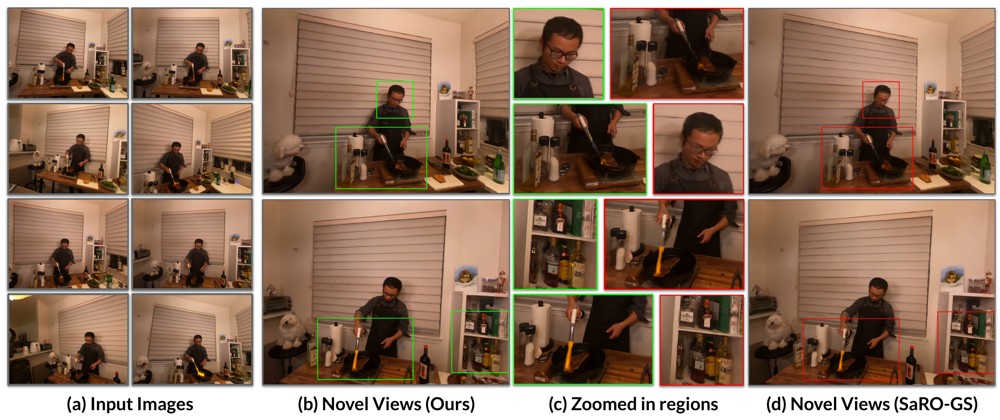

# Towards Alias-Free 4D Gaussian Representations with Motion-Aware Filtering

[Ankit Dhiman](https://ankitdhim.github.io/)<sup>1,2</sup> &nbsp;·&nbsp;
[Kunal A Kathare](https://kunalkathare.github.io/)<sup>1</sup> &nbsp;·&nbsp;
Pranav Vignesh<sup>1</sup> &nbsp;·&nbsp;
[Lokesh R Boregowda](https://in.linkedin.com/in/lokesh-boregowda-14321810)<sup>2</sup> &nbsp;·&nbsp;
[R. Venkatesh Babu](https://cds.iisc.ac.in/faculty/venky/)<sup>1</sup>

<sup>1</sup>Indian Institute of Science, Bangalore &nbsp;&nbsp;
<sup>2</sup>Samsung R&D Institute India – Bangalore

[](https://arxiv.org/abs/2608.21828)
[](https://maaf-4dgs.github.io/)



---

## Overview

4D Gaussian representations alias badly when novel views are rendered at a scale other than the
one they were trained on — most visibly under zoom-in and zoom-out. Static anti-aliasing filters
such as the 3D smoothing filter of Mip-Splatting do not fix this, because they assume a
*constant* sampling rate per primitive and therefore ignore local motion.

**MAAF** replaces that constant sampling rate $\hat{\nu}_k$ with a *time-varying* one
$\hat{\nu}_k(t)$, estimated non-parametrically. For every Gaussian we build a joint density over
time and the focal-to-depth ratio using a Parzen-window estimator with a Weibull kernel, then
sample from it at render time to pick the filter width. Because the filter acts on the
*projected* 3D Gaussians and touches nothing else, it drops into different 4D backbones
unchanged.

## Backbones

The filter is representation-agnostic. This repository hosts one self-contained release per
backbone; pick the one matching the results you want to reproduce.

| Backbone | Directory | Datasets | Status |
|---|---|---|---|
| **SpeeDe3DGS** | [`SpeeDe3DGS/`](SpeeDe3DGS/) | D-NeRF (synthetic) | ✅ Released |
| **SaRO-GS** | `SaRO-GS/` | Plenoptic Video, D-NeRF, HyperNeRF | 🚧 Coming soon |

**SaRO-GS is the primary backbone** — the main tables of the paper (Plenoptic Video, D-NeRF and
HyperNeRF) are produced with it. **We further show experiments on SpeeDe3DGS** which shows the same
filter transfers unchanged to a different 4D representation and mitigates the alisasing artefacts.

Each directory is a standalone codebase with its own environment.

## Citation

If you find this work useful, please cite:

```bibtex
@misc{dhiman2026aliasfree4dgaussianrepresentations,
      title={Towards Alias-Free 4D Gaussian Representations with Motion-Aware Filtering}, 
      author={Ankit Dhiman and Kunal A Kathare and Pranav Vignesh and Lokesh R Boregowda and Venkatesh Babu Radhakrishnan},
      year={2026},
      eprint={2608.21828},
      archivePrefix={arXiv},
      primaryClass={cs.CV},
      url={https://arxiv.org/abs/2608.21828}, 
}
```

Please also cite the backbone you build on — [SpeeDe3DGS](https://speede3dgs.github.io/),
[SaRO-GS](https://yjb6.github.io/SaRO-GS.github.io/), [Deformable-3DGS](https://github.com/ingra14m/Deformable-3D-Gaussians),
[Mip-Splatting](https://github.com/autonomousvision/mip-splatting) and
[3D Gaussian Splatting](https://github.com/graphdeco-inria/gaussian-splatting).

## License

The code original to this project is released under the [MIT License](LICENSE).

## Acknowledgements

Built on top of [SpeeDe3DGS](https://speede3dgs.github.io/),
[SaRO-GS](https://yjb6.github.io/SaRO-GS.github.io/) and
[Deformable-3D-Gaussians](https://github.com/ingra14m/Deformable-3D-Gaussians). The 2D screen-space
filter follows [Mip-Splatting](https://github.com/autonomousvision/mip-splatting). We thank the
authors for releasing their code.
